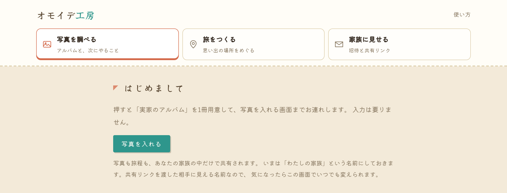
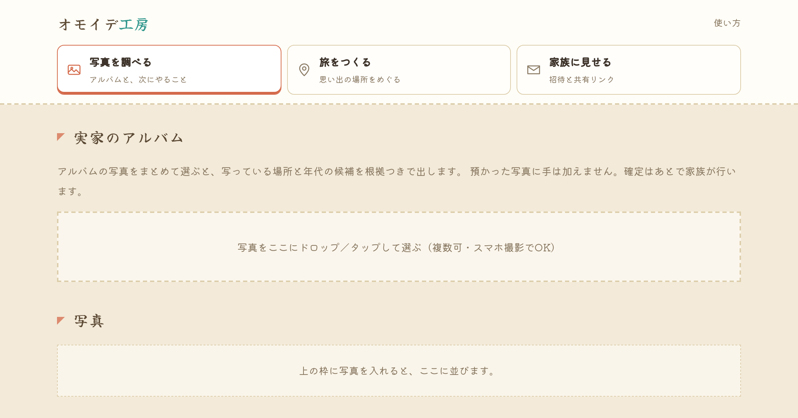
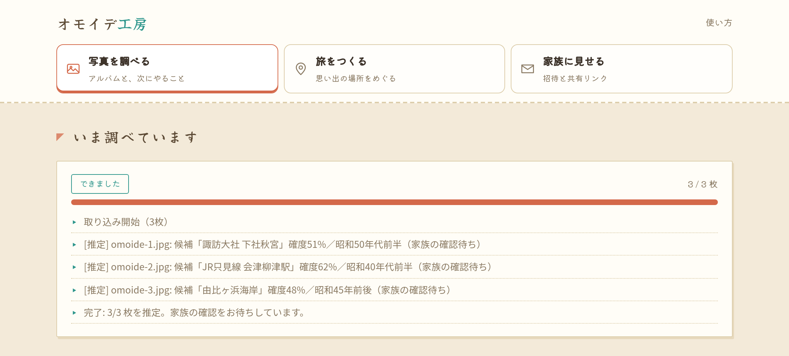
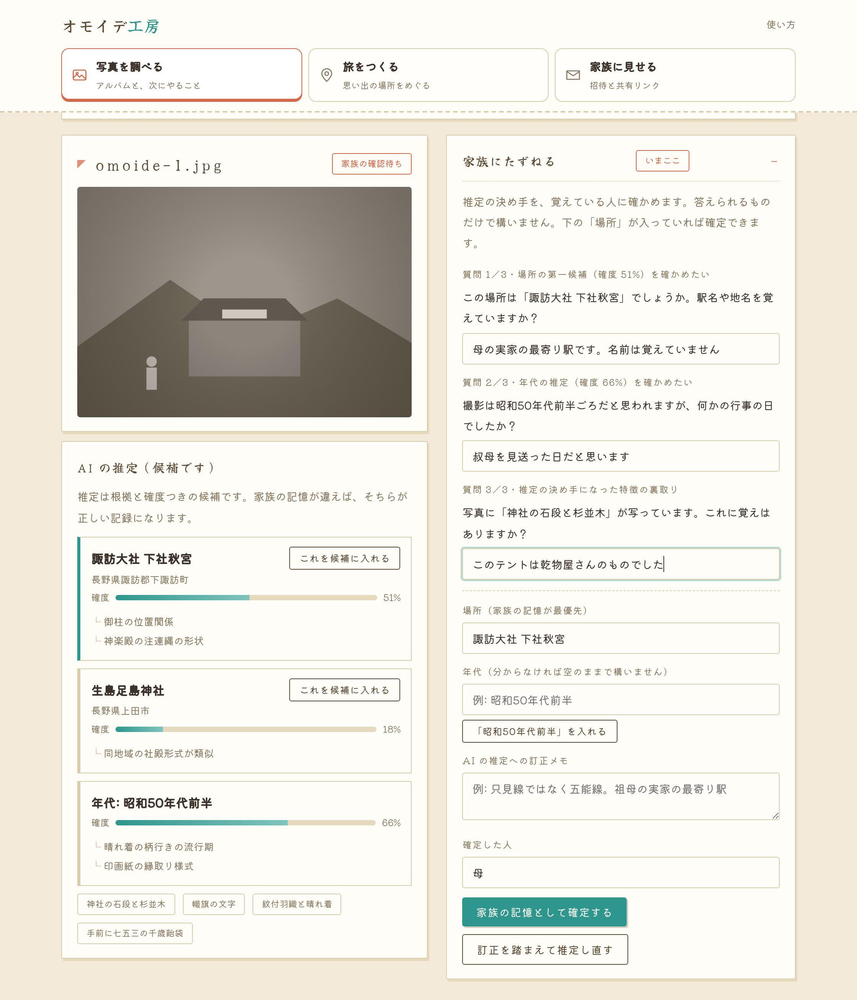
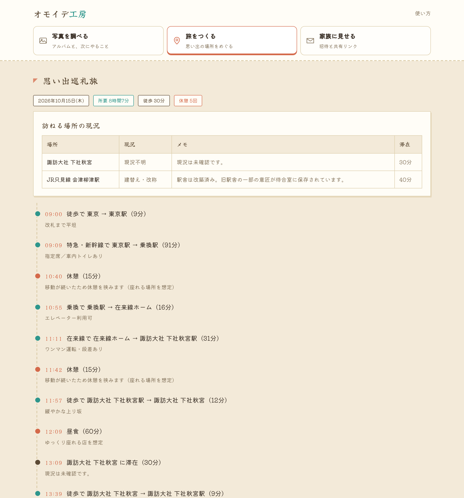
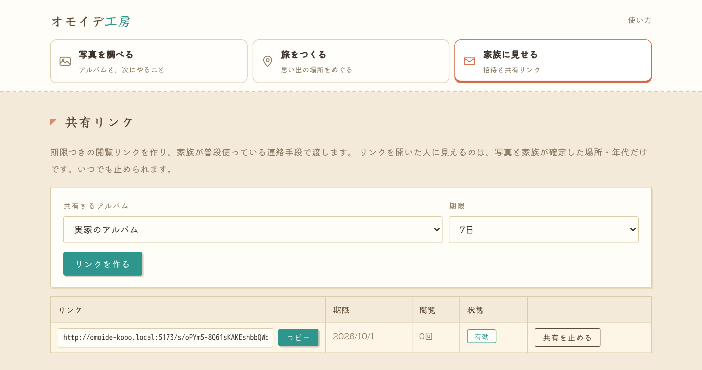

# オモイデ工房

思い出の場所さがし × 巡礼旅エージェント。

実家の白黒写真に写っている場所と年代を根拠つきで推定し、
家族の記憶で確定して、思い出の場所をもう一度巡る旅程まで組み立てます。

写真の整理アプリが「分類」で止まるところを、家族の会話と旅まで運ぶのが狙いです。

## アーキテクチャ

## できること

1. アルバムの写真をまとめて取り込む（スマホ撮影でよい）→ 家族限定の領域に、**手を加えずそのまま保管**
2. 駅舎・看板・車両型式・服装・地形から、撮影地と年代を**根拠と確度つきの候補**として提示
3. 家族に確認質問を出し、家族が確定・訂正 → 訂正は同じアルバムの後続推定に反映される
4. 確定した場所の現況（現存 / 建替え / 廃止）を確かめ、親の体力に合わせて休憩を挟んだ旅程を作る
5. アルバムや写真は期限つきリンクで家族に共有する

## 画面

入口から旅程まで、実際の操作順です。
画像は [docs/shots.js](docs/shots.js) が画面を操作して撮っているので、画面を変えたら撮り直すだけで追随します。

**① はじめる** — 入力は要りません。ボタンひとつで、写真を入れる画面まで進みます。

**② 写真を入れる** — アルバムのページをスマホで撮って、まとめて放り込みます。

**③ 推定が終わるのを待つ** — 1枚ずつ、撮影地と年代の候補が出ます。

**④ 質問に答えて、場所を確定する** — 候補には根拠と確度がつきます。

**⑤ 巡礼の旅程を組む** — 現況を確かめ、休憩と昼食を挟んだ一日にします。

**⑥ 家族に共有する** — 期限つきのリンクを作って、普段の連絡手段で渡します。

