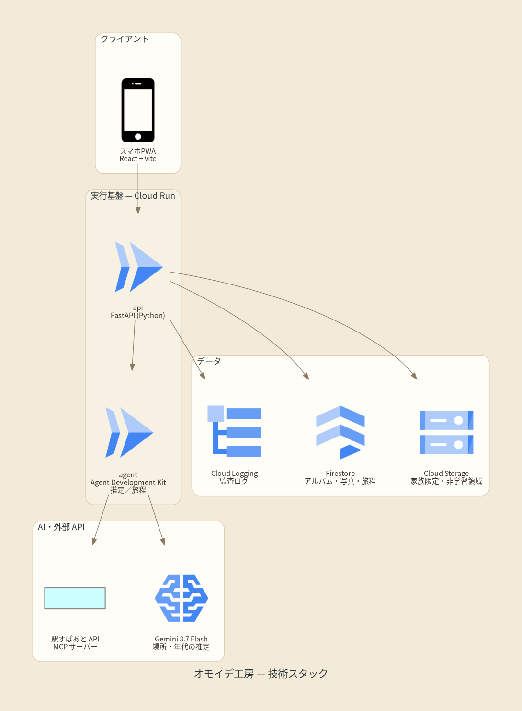

# オモイデ工房

思い出カラー化 × 巡礼旅エージェント（[設計書](設計書.md) の実装）。

実家の白黒写真を一括でカラー化・修復し、写っている場所と年代を根拠つきで推定し、
家族の記憶で確定し、語りを記録して、思い出の場所をもう一度巡る旅程まで組み立てます。

カラー化アプリが「変換」で止まるところを、家族の会話と旅まで運ぶのが狙いです。

## 動かす

```bash
docker compose up --build
```

- 画面: http://localhost:5173 （トップは機能と使い方の案内ページ。「アルバム」から実際に使えます）
- API: http://localhost:8080

外部 API のキーは要りません。Gemini・YouCam・GMI Cloud・駅すぱあと・Speech はモックで動くので、
鍵がない状態でも取り込みから旅程作成まで一通り試せます。
データは Firestore（開発中はエミュレータ）に入り、写真の実体はオブジェクトストレージに置かれます。

開発するときは [CONTRIBUTING.md](CONTRIBUTING.md)、Google Cloud に載せるときは [DEPLOY.md](DEPLOY.md) を見てください。

## アーキテクチャ



## できること

1. アルバムの写真をまとめて取り込む（スマホ撮影でよい）→ オリジナルは家族限定の領域に保全
2. ノイズ除去 → 退色補正 → カラー化 を自動で適用。あわせて別系統（復元＋再照明）も作り、**どちらを採るかは家族が見比べて決める**
3. 駅舎・看板・車両型式・服装・地形から、撮影地と年代を**根拠と確度つきの候補**として提示
4. 家族に確認質問を出し、家族が確定・訂正 → 訂正は同じアルバムの後続推定に反映される
5. 写真を見ながらの語りを録音 → 人物・出来事を候補として抽出（家族が承認するまで未確定）
6. 確定した場所の現況（現存 / 建替え / 廃止）を確かめ、親の体力に合わせて休憩を挟んだ旅程を作る
7. カラー化した写真を数秒だけ動かす「ウゴクアルバム」（同意と透かしについては後述）
8. アルバムや写真は期限つきリンクで家族に共有する

## 設計の芯

この 4 つは機能というより、家族の写真を扱う以上ゆずれない前提です。

**学習には使わない。** 写真と音声は `family/{familyId}/…` 配下にしか置けず、その外の参照は弾かれます。
外部 API を叩いた事実は、学習オプトアウト設定つきで監査ログと Cloud Logging に残ります。

**AI の推定は、家族の記憶を上書きしない。** 場所や年代は常に「候補・根拠・確度」であって確定値ではありません。
AI の推定（`estimate`）と家族の記憶（`confirmed`）は別のフィールドに保たれ、表示は必ず家族の確定を優先します。
訂正しても AI の推定は消えず、次の推定の手がかりになります。

**人物の関係を AI が決めない。** 語りから抽出した人物・出来事は「候補」のまま保持され、
家族が承認したものだけが確定します。故人や第三者が写っていても、AI が関係を断定することはありません。

**いつでも消せる。** 家族単位の完全削除をワンアクションで実行でき、消したという証跡だけが残ります。

## ウゴクアルバム

カラー化した写真を数秒だけ動かします。故人が写る写真を動かすことになるので、機能より先に歯止めを決めています。

- **亡くなった家族が写る場合、参加している家族全員の同意が揃うまで生成しません。** 一人でも同意しなければ生成しません
- 動かすのは**その場の自然な動き（風・光・わずかな身じろぎ）だけ**。しゃべらせたり、写っていない行動を足したりしません
- 生成物には必ず **AI 生成の透かし**が入り、実写真と混ざりません
- 依頼・同意・生成範囲は、すべて監査ログに残ります

## 共有について

外部のメッセージング API は使いません。推測できないトークンつきの閲覧 URL（`/s/{token}`）を発行し、
家族がそれを LINE でもメールでも、普段の連絡手段で渡します。鍵の準備も送信先の登録も要りません。

- 期限は必須（1〜90日）。切れたリンクは開けません
- いつでも共有を止められます。閲覧のたびに回数と証跡が残ります
- 閲覧者に見えるのは、家族が確定した場所・年代と語りの要約だけ。AI の推定候補や確認質問は渡りません
- 写真単位のリンクからは、同じアルバムの他の写真は見られません

## エージェント構成

| エージェント | 役割 | 自律性 |
|---|---|---|
| Orchestrator | 取り込み→修復→推定→旅程のパイプライン進行 | 自律 |
| 修復 | カラー化・退色/折れ修復・ノイズ除去 | 自律（元画像は常に保全） |
| 推定 | 場所・年代を根拠と確度つきで提示 | 提示まで（確定は家族） |
| 語り | 会話音声から人物・出来事を抽出し写真に紐付け | 抽出は自律（確定は家族） |
| 旅程 | 地点の現況確認 → 移動負荷の低い旅程生成 | 提案まで |
| ウゴクアルバム | カラー化写真を数秒動かす | 家族全員の同意が揃うまで動かない |
